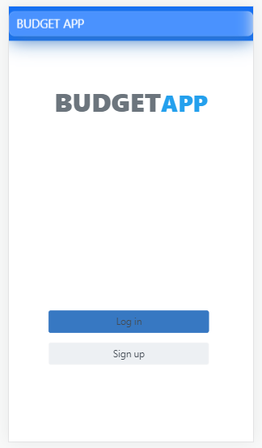
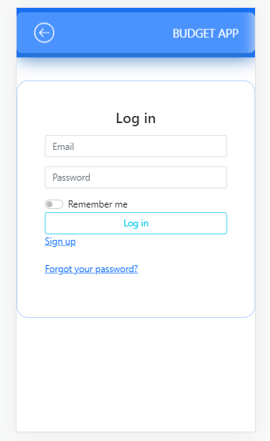
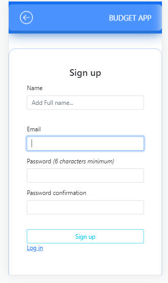
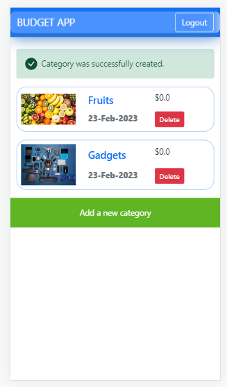
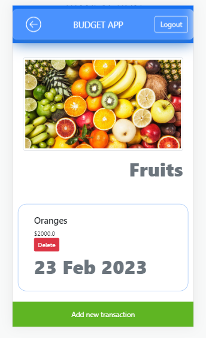

# Budget App

> Budget App is a mobile web application that allows you to manage your budget: you have a list of transactions associated with a category, so that you can see how much money you spend and on what.

## Preview

### Home Page



### Login-up Page



### Sign-up Page



### Category Page



### Transaction page



## Built With

- Major languages (Ruby)
- Framworks (Ruby on Rails)
- Testing libraries(Rspec)
- Markup (HTML)
- Styles (CSS, Bootsrap

## Live version

- Visit [Budget-App](https://tashbudgetapp.onrender.com)

## Video Demo

- Visit [Budget-App](https://drive.google.com/file/d/1X8Z0AgUmcM-dQSERuXzzlUrxztV6nqq8/view?usp=sharing)

## Getting Started

To get a local copy up and running follow these simple example steps.

### Prerequisites
- A text editor(preferably Visual Studio Code)

### Install
- Ruby
- Ruby on Rails
- PostgresSQL
- Rspec

### Using it Locally

- Clone the project

```
git clone https://github.com/tashisrael/Budget-app.git

cd Budget-app

```

### Setup

Install gems with:

```
bundle install
```

Setup database with:

```
rails db:create
rails db:migrate
```

### Usage

Start server with:

```
rails s
```

Visit http://localhost:3000/ in your browser.

### Run tests

Install npm with:

```
npm i
```

Install rspec with:

```
bundle install
```

and

```
rails generate rspec:install
```

run the test with:

```
rspec spec
```


## Visit And Open Files

[Visit Repo](https://github.com/tashisrael/Budget-app)

## Download Repo

[Download Repo](https://github.com/tashisrael/Budget-app/archive/refs/heads/dev.zip)


## Authors

👤 **Tashobya Israel**

- GitHub: [@githubhandle](https://github.com/tashisrael)
- Twitter: [@twitterhandle](https://twitter.com/tashisrael)
- Linkedin: [@linkedinhandle](https://www.linkedin.com/in/tashobya-israel-6a66b0181/l)

## 🤝 Contributing

Contributions, issues, and feature requests are welcome!

Feel free to check the [issues page](https://github.com/tashisrael/Budget-app/issues).

## Show your support

Give a ⭐️ if you like this project!

## Acknowledgments

- Original design: [Gregoire Vella](https://www.behance.net/gregoirevella) on [Behance](https://www.behance.net/gallery/19759151/Snapscan-iOs-design-and-branding?tracking_source=)
- Inspiration: Microverse

## 📝 License

This project is [MIT](./LICENSE.md) licensed.
